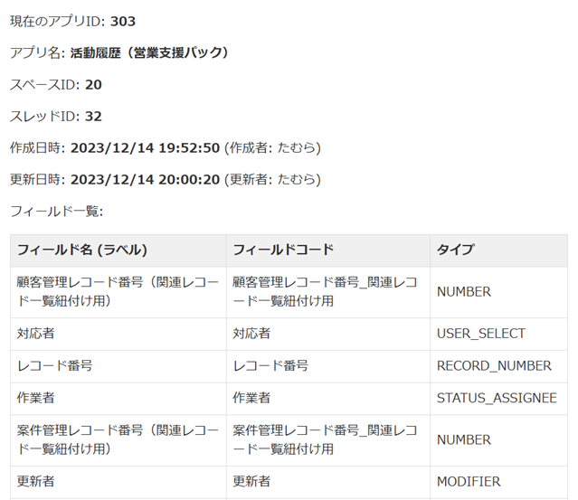

# アプリ情報を表示

現在表示しているアプリのフィールド情報などが確認できます。

## 使い方

1.  アプリの`一覧画面`、`詳細画面`、`編集画面`のいずれかを開いた状態で`アプリ情報を表示`を選択

    

 

2.  アプリの情報が表示されます。

## 注意事項

> [!NOTE]
> ゲストスペースのアプリは現行バージョンでは非対応です。

<!-- > [!NOTE] -->
<!-- > [!TIP] -->
<!-- > [!IMPORTANT] -->
<!-- > [!WARNING] -->
<!-- > [!CAUTION] -->

## その他

### 作成者

- たむら
  - 𝕏: [@Tam4641](https://x.com/Tam4641)
