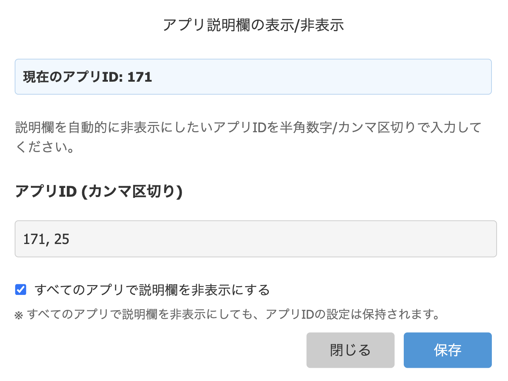
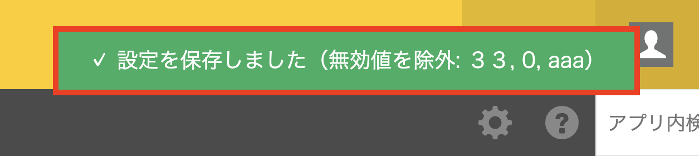

# アプリ説明欄の表示/非表示

アプリ説明欄を自動的に表示/非表示することができます。
指定したアプリでは説明欄が自動的に閉じた状態で表示されます。

## 使い方

### 1. 設定ダイアログを開く

Devkinox の拡張機能アイコンをクリックし、`アプリ説明欄の表示/非表示` を選択します。

### 2. 非表示ルールを設定

説明欄を自動的に非表示にしたいアプリIDを半角数字/カンマ区切りで入力します。
アプリ画面では現在表示中のアプリIDも表示されるため、入力の参考にできます。

> [!NOTE]
> ポータル画面などアプリ以外の画面でも設定ダイアログは利用できます。
> ただし、その場合は現在のアプリIDは表示されません。

また、`すべてのアプリで説明欄を非表示にする` を有効化すると、全アプリが対象になります。
このチェックが ON の間は、アプリID入力欄は編集できません。

> [!TIP]
> 例: `1, 54, 67` のように複数のアプリ ID を設定できます。

> [!NOTE]
> `すべてのアプリで説明欄を非表示にする` を ON にしても、個別のアプリID設定は保持されます。
> OFF に戻すと、保持されていた個別設定が再び適用されます。

### 3. 設定を保存

「保存」ボタンをクリックすると、設定が保存されます。
保存後は現在の画面にも反映されます。

入力に無効な値（数値以外、0 以下など）が含まれている場合は、その値を自動的に除外して保存し、
保存完了メッセージに「除外した無効値」が表示されます。
保存完了メッセージは約 4 秒表示されます。

また、対象ページを開いた瞬間にも設定が自動適用されます。

## 機能の詳細

### 自動適用

- 設定は localStorage に保存されます
- 設定したアプリを開いた瞬間に、自動的に説明欄が閉じられます
- 一覧／詳細／編集／追加／グラフ画面で動作します
- `すべてのアプリで説明欄を非表示にする` を ON にすると、対象画面では常に非表示になります

### 設定の変更

設定を変更したい場合は、拡張機能から再度このアドオンを選択してダイアログを開き、アプリIDを入力してください。

### 設定の解除

特定のアプリで説明欄を再び表示したい場合は、そのアプリIDを削除して保存してください。

全アプリ対象を解除したい場合は、`すべてのアプリで説明欄を非表示にする` のチェックを OFF にして保存してください。

## 注意事項

> [!NOTE]
> 設定はブラウザの localStorage に保存されるため、別のブラウザやデバイスでは設定が共有されません。

> [!WARNING]
> localStorage をクリアすると、設定が削除されます。

## その他

### 技術的な仕様

- 設定データは JSON 形式で localStorage に保存されます
- kintone の標準 API（`kintone.app.showDescription`）を使用しています
- 無効なアプリID（数値以外、0 以下）は自動的に除外されます
- 無効値が除外された場合は、保存完了メッセージに除外内容を表示します
- kintone オブジェクト初期化の遅延には、プロパティフックで準備完了を検知してイベント登録します

### 作成者

- アシノ
  - 𝕏: [@ashinohitooo](https://x.com/ashinohitooo)
